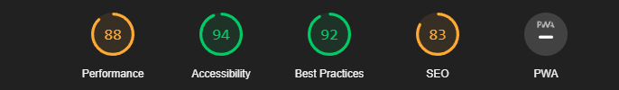

# Anteckna medans du arbetar

* Vad gjorde du igår?
* Vad ska du göra idag?
* Vad hindrar dig från att göra framsteg?

# 1 november 2022

## Vad jag gjort
* Analyserat figma skissen
* Laddat ner bilder och redigerat dem till det som de skulle vara
* Letade annan choklad bild pga att länken inte fungerade
* Byggt upp skeletet stuktur så som
    * Lagt till alla html filer som ska finnas
    * Fixat en reset.css samt en style.css
    * Lagt till en image mapp samt bilder
* har lagt till font
* Jag har gjort homepage med hjälp av css samt html.
* Media använts för att anpassa för mobil samt dator
    * Media har använts för att gömma text via div classen .hidden-mobile {display: none;}
    * Samt att byta ut publication och about till en pil under bilden som leder till "about"

## Vad jag ska göra
* Jag ska lägga in innehållet från figma skissen på "about" och "publication"
* Sena ska jag fixa css till de två html filerna
* titta github hosting så att det fungerar
* validera sidan
### Problem?
Nej

# 3 november 2022
## Vad jag gjort
* Jag har gjort about pagen samt publication
* har fixat css för att kunna göra about och publication
* Jag har tittat så att github hosting fungerar
* Jag har validerat sidan med https://validator.nu/ och fick inga errors allt var 🟢
* Jag använde https://jigsaw.w3.org/css-validator/ märkte ett fel och fixade felet (parsningfel var saknades i en var(--color-text) på rad 54 i style.css.
* Använt bara fel med tomma länkar men har ingenstans att länka dem eftersom det skulle kräva resurser jag inte har. Samnt ett par empty formlabels
* Körde Lighthouse och fick 

Performance ska vara delvis fixat pga ändring av png till webp men är nöjd med resten

### Problem?
* Publications till publications funkar inte på mobil
* Lite problem med att få allt att funka på pages pga en stor bokstav i publications (fixat)
* Hade lite problem med att få till sticky på sidebaren men är lugnt
* Hade väldigt svårt att hitta information angående hur man skapade en hover låda men lyckades fixa i slutändan

# 6 december 2022
## Vad har jag gjort
* jag har fixat så att contact är länkad med hjälp av "mailto:text"

## Vad ska jag göra
* Jag ska anteckna lite extra om hamburgar menyn
* Jag ska gå igenom github pages för att titta så allt fungerar
* Jag ska felsöka med hjälp av wave
* fixa webp med allteningen <picture> <src></src> </picture> eller byta fromat till png eller jpg
