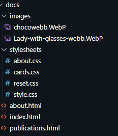
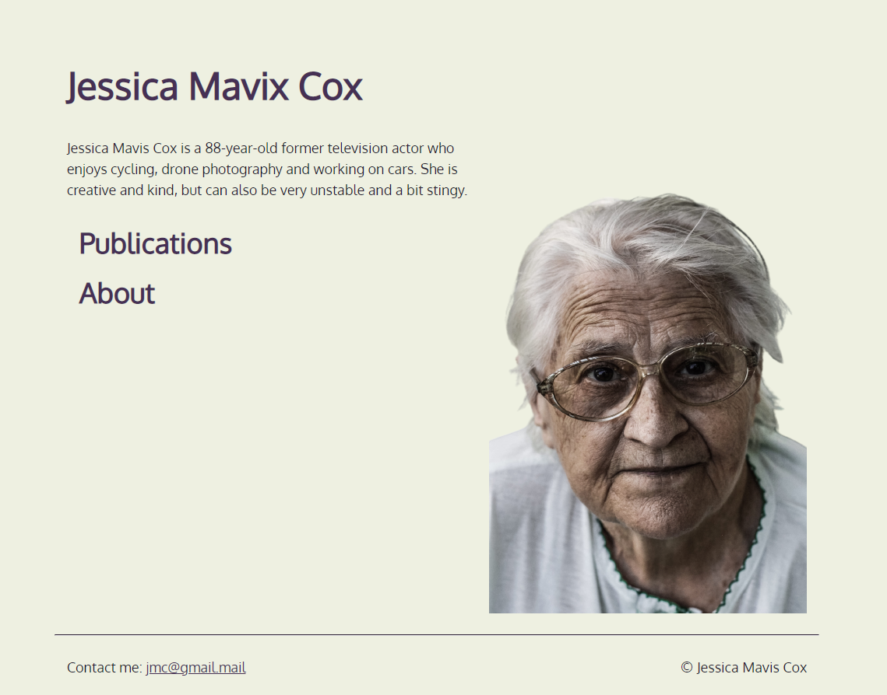

# JMC Lovskola

Noah E.R 3/11/2022

## Inledning
Målet var att skapa en hemsida så lik som möjligt utitifrån en [figma skiss](https://www.figma.com/file/n9dJBwH4mYwa4dMU7ysDyF/Jessica-Mavis-Cox?node-id=0%3A1) som Jens delade.
### Ide
Tanken var att jag då skulle återskapa figma skissen till det bästa utav mina html och css förmågor.
### Genomförandet
* Titta figma skiss
* Skapa de filer som behövs
* Fixa och lägg in bilder
* lägg in allt innehåll
* Gör mobilsida först
* Desktop anpassa

repeat
## Bakgrund

### Genomförandet
* Titta figma skiss
* Skapa de filer som behövs

* Fixa och lägg in bilder
* lägg in allt innehåll

* Gör mobilsida först
* Desktop anpassa

repeat

### Genomföringsdetaljer
Jag började med att titta på figma skissen och hämta allt matrial och bilder för projektet. Jag byggde sedan upp
 ett enkelt skelett för hemsidan med html filer och css. När jag hadde lagt till alla filer började jag med startsidans
  mobil verision genom att först trycka in allt innehål, text samt bilder. Jag började sedan på css för att få det till 
  vad jag ville ha. Sedan skapade jag en media css för mobil och desktop för att skilja det åt.
   Detta är sammanfattat hur jag arbetade med detta.

## Positiva erfarenheter
Väldigt mycket har gått bra för mig så svårt att säga något spesifikt, men om jag skulle behöva säga något så skulle jag säga att jag känner mig väldigt nöjd med hur mina div classer har funkat för att skapa en bra grund och få allting där jag vill ha dem. Anledningen bakom detta är att jag har börjat känna mig bekväm med hur "lådorna" sätter sig med hjälp av flex och de olika flex typerna.

## Negativa erfarenheter
css kunde varit stabilare och mindre utspritt men vet nu hur jag kan fixa det i framtiden. fixet är bara att skapa fler css filer tidigare och ha ett mer genomtänkt nät av vad som kommer behövas varts.

Den orginella bilden på chokladen fanns inte så behövde hitta en egen. Kanske kan kontakta lärare i framtida projekt om det finns matrial som inte existerar/funkar.
## Sammanfattning
Lärt mig mer om sticky, media, och hur display samt flex fungerar. Största dels har varit mer av en påminellse men har lärt mig en hel del under processen också. Finns några få saker speciellt i css som jag skulle kunnat göra effektivare och mer samlat men känner mig ändå ganska nöjd.

Utvecklingsmöjligheterna för projektet skulle möjligtvis vara att länka alla böcker till alltingen ett biblotek eller wiki.

Kunskaper som skulle kunna förbättras är css planering.